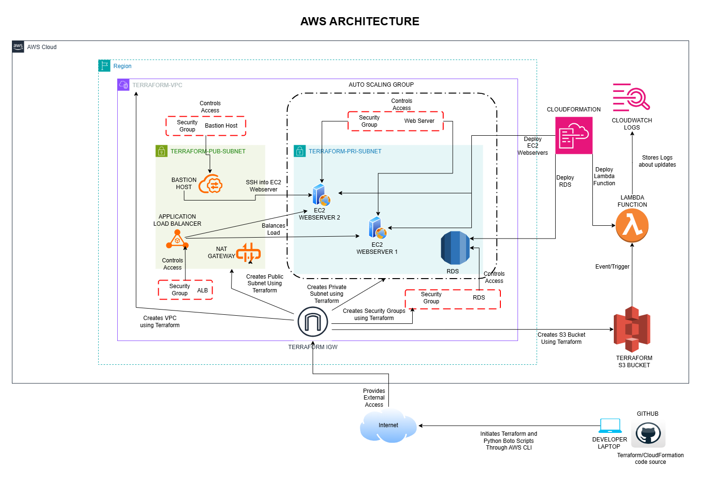

# AWSProject
Cloud Project Deployed on AWS

## 🗺️ Architecture Diagram

# AWS Cloud Infrastructure Project

This project demonstrates an end-to-end AWS setup using Terraform, CloudFormation, Lambda, and Boto3 scripts.

---

## Part 1: Infrastructure Deployment

- **Terraform**: Creates VPC, public/private subnets, NAT gateway, route tables, and security groups.
- **CloudFormation**: Deploys EC2 (web server), RDS (MySQL), and Lambda.
- **Web App**: Apache installed on EC2 via UserData to serve a simple HTML page.
- **RDS Setup**: EC2 connects to RDS and stores sample user data.
- **Auto Scaling**: Set up via EC2 Launch Template and Auto Scaling Group (min=1, max=3 instances).

---

## Part 2: Lambda Logging for S3 Uploads

- Created an S3 bucket: `chaitanya-uploadlogs`
- Lambda function `LogS3Uploads` logs file upload events to CloudWatch.
- Triggered on all `PUT` events to the S3 bucket.

---

## Part 3: AWS CLI & Boto3 Interaction

Python scripts using Boto3:
- `create_and_upload_to_s3.py`: Creates a bucket and uploads a file.
- `get_instance_metadata.py`: Retrieves metadata from inside EC2.
- `list_running_instances.py`: Lists running EC2 instances.
- `invoke_lambda.py`: Manually invokes the Lambda function with a mock S3 event.

AWS CLI was also used to validate services and manage resources.

---

## Part 4: API Gateway & Step Functions

- API Gateway: Configured to expose the LogMessageLambda function via a public HTTP endpoint, allowing it to be triggered using a POST request.
- Step Function Workflow: Created a state machine that automates the sequential execution of LogS3Lambda followed by LogMessageLambda, enabling chained Lambda orchestration without manual triggers.

---
